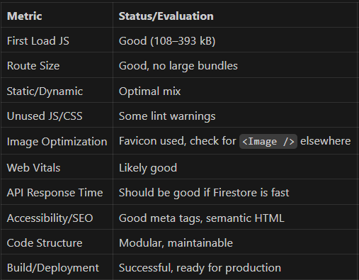

Yes, This is a [Next.js](https://nextjs.org) project

# Getting Started
Your beloved productivity app, all in one.

## 🧠 Philosophy Behind Odyssey

Odyssey is more than a habit tracker. It’s a personal growth engine inspired by:

Stoicism and mindfulness

Video game mechanics (XP, levels, rewards)

Neuroscience & psychology (energy-based tracking, focus tips)

Gamified productivity (Atomic habits, Kaizen, Flow theory)

It adapts to you — not the other way around.


## ✨ Upcoming Features

##### 🪙 Coin Shop to redeem perks

##### 🧬 AI-generated personalized challenges

##### 🌐 Public leaderboard with anonymous stats

##### ⏳ Pomodoro + Focus Timer

##### 📖 Life journal with streak & mood memory

##### 📅 Calendar integrations


## Introduction

Odyssey is a prodcutive all-in-one web app which helps you to visualize your real life scoreboard

### Metrics in build

#### Summary Table


First, run the development server:

```bash
npm run dev
# or
yarn dev
# or
pnpm dev
# or
bun dev
```

Open [http://localhost:3000](http://localhost:3000) with your browser to see the result.

You can start editing the page by modifying `app/page.tsx`. The page auto-updates as you edit the file.

## Learn More

To learn more about Next.js, take a look at the following resources:

- [Next.js Documentation](https://nextjs.org/docs) - learn about Next.js features and API.
- [Learn Next.js](https://nextjs.org/learn) - an interactive Next.js tutorial.

You can check out [the Next.js GitHub repository](https://github.com/vercel/next.js) - your feedback and contributions are welcome!